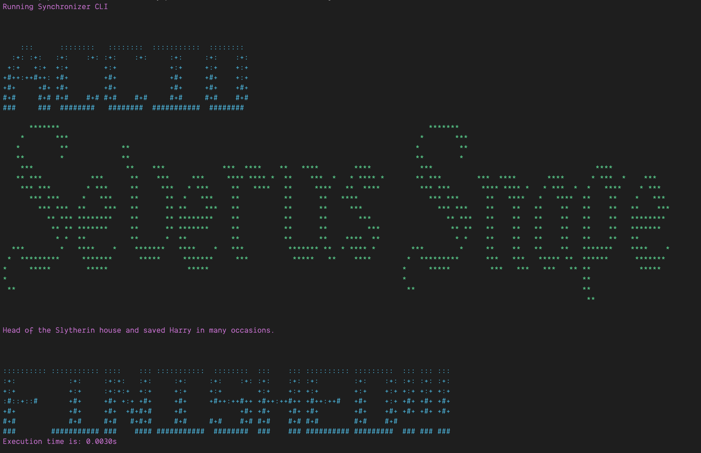

# Harry Potter Character - Random

## Get your random character

Install and build the project in your machine

```bash
npm i && npm run build
```

Get your random character from Harry Potter executing command as below:

```bash
node ./dist/index.js
```

If you want to show help of command you can execute:

```bash
node ./dist/index.js -h
```

Or if you want to have bio as well run the following command:

```bash
node ./dist/index.js -b
```

or:

```bash
node ./dist/index.js --bio
```


